### Hackathon: Concordium Hackathon - The Future of Identity
# TASK 1: Setup Development Environment

# Step 1: Install Rust and cargo-concordium

Download and run Rustup in my case for `windows 11 platform`.
[rustup-init.exe](https://win.rustup.rs/x86_64)

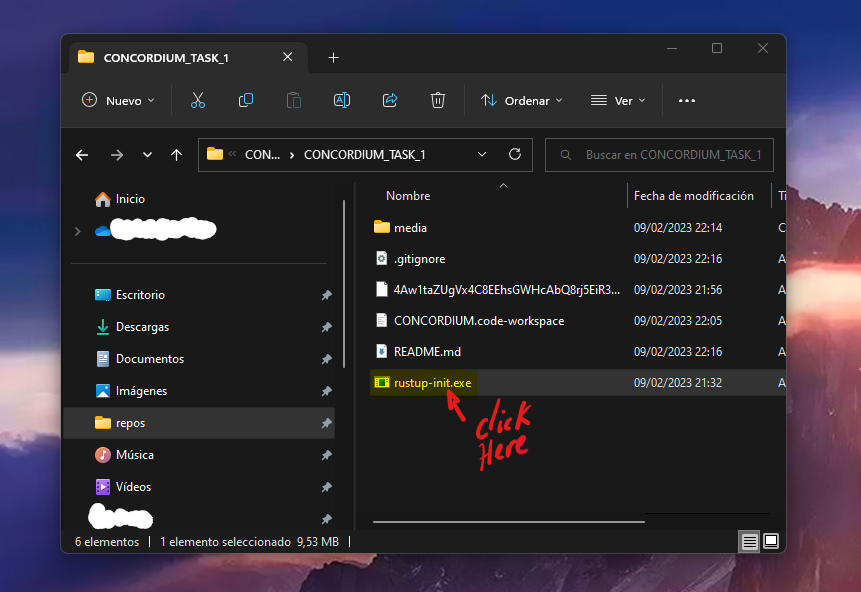

A new terminal should open:

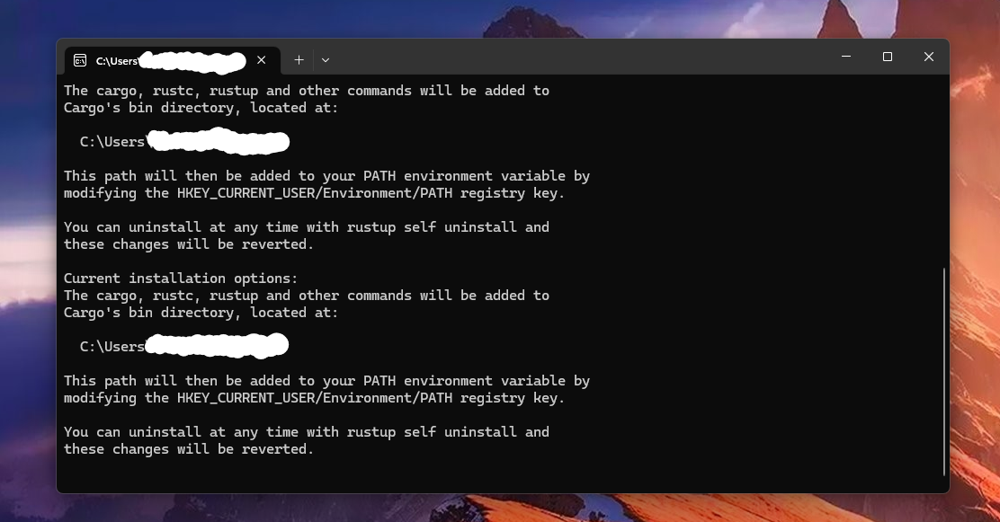

Follow instructions until 

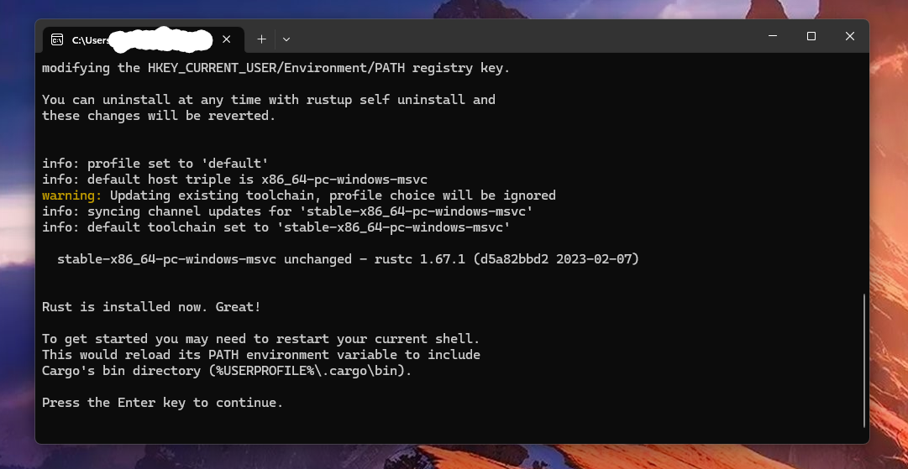

install wasm

```console
rustup target add wasm32-unknown-unknown
```

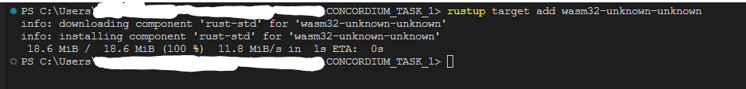

Download  cargo-concordium, from powershell:
```terminal
PS> Invoke-WebRequest https://distribution.concordium.software/tools/windows/signed/cargo-concordium_X.X.X.exe -OutFile cargo-concordium.exe
```

Moving the executable to a folder that is already on your PATH, for example %HOMEPATH%\.cargo\bin\ for Windows
```console
PS> mv .\cargo-concordium.exe  $Env:HOMEPATH\.cargo\bin\ 
```

check instalation (in a new powershell terminal)

```console
PS> cargo-concordium --version
cargo-concordium X.X.X
```

# Step 2: Install Concordium Client

```terminal
PS> Invoke-WebRequest https://distribution.concordium.software/tools/windows/signed/concordium-client_5.0.2-0.exe -OutFile concordium-client.exe
```

Moving the executable to a folder that is already on your PATH, for example %HOMEPATH%\.cargo\bin\ for Windows

```console
PS> mv .\concordium-client.exe  $Env:HOMEPATH\.cargo\bin\ 
```

check instalation (in a new powershell terminal)

```console
PS> concordium-client --version
X.X.X
```

Connect to the public node with the following command

```console 
PS> concordium-client consensus status --grpc-port 10000 --grpc-ip node.testnet.concordium.com
Best block:                  0e0bb66767fe46537454e13c3a6ae0cbe17ef5a2f589972d997ff7f8d8e39e0c
Genesis block:               4221332d34e1694168c2a0c0b3fd0f273809612cb13d000d5c2e00e85f50f796
Genesis time:                2022-06-13 10:00:00 UTC
Slot duration:               250ms
Epoch duration:              1h
Last finalized block:        0e0bb66767fe46537454e13c3a6ae0cbe17ef5a2f589972d997ff7f8d8e39e0c
Best block height:           2054263
Last finalized block height: 2054263
Blocks received count:       20688
Block last received time:    Thu,  9 Feb 2023 21:59:05 UTC
Block receive latency:         111 ms (EMA),    53 ms (EMSD)
Block receive period:         6909 ms (EMA),  7315 ms (EMSD)
Blocks verified count:       20688
Block last arrived time:     Thu,  9 Feb 2023 21:59:05 UTC
Block arrive latency:          118 ms (EMA),    53 ms (EMSD)
Block arrive period:          6909 ms (EMA),  7316 ms (EMSD)
Transactions per block:         0.152 (EMA),    0.359 (EMSD)
Finalization count:          18609
Last finalized time:         Thu,  9 Feb 2023 21:59:06 UTC
Finalization period:          8721 ms (EMA),  8906 ms (EMSD)
Protocol version:            P5
Genesis index:               2
Current era genesis block:   7687b54a59fa29d40c69278a01ddd33a40a8fdd6775a3a01343b3576205db1e1
Current era genesis time:    2022-11-22 11:05:19.5 UTC
```

# Step 3: Setup a wallet

Install [concordium-wallet extention](https://chrome.google.com/webstore/detail/concordium-wallet/mnnkpffndmickbiakofclnpoiajlegmg?hl=en-US)

Follow extension instructions to install a wallet and create a new 
identity from `Concordium testnet IP` => [instructions](https://developer.concordium.software/en/mainnet/net/browser-wallet/setup-browser-wallet.html#setup-bw)

On completion:

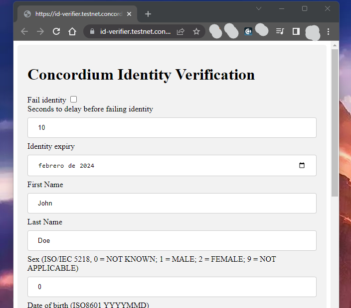

You can change those values and then submit:

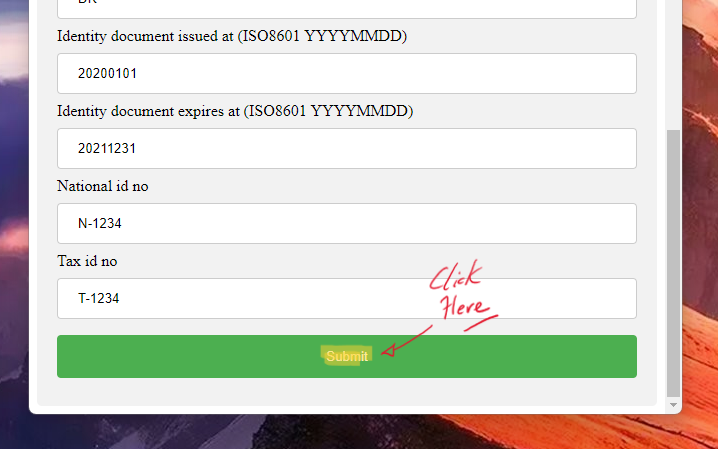

Use your wallet to export your keys

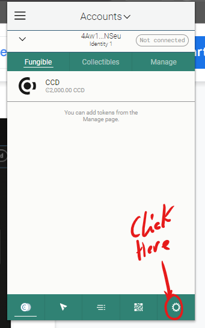
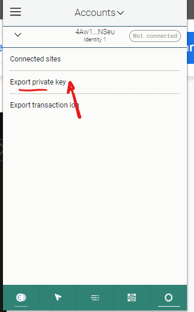
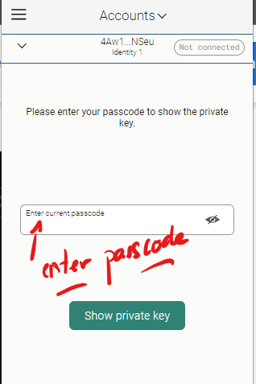
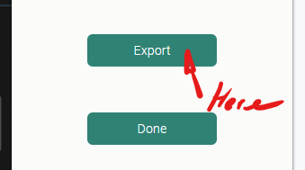

Request 2000 CCD from fautcet

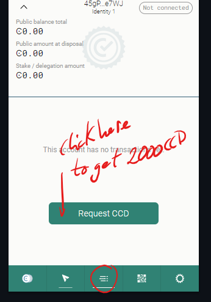

You can now use <YOUR PUBLIC ADDRESS.export> to create a
`concordium-client` config and `wallet` 


# Final step: Import the key


```console
PS> concordium-client config account import <YOUR PUBLIC ADDRESS.export> --name <Your-Wallet-Name>

Enter encryption password: <TYPE_A_PASSWORD>

....


Added name mapping: '<Your-Wallet-Name>' --> '<YOUR PUBLIC ADDRESS>'.
Warning: Importing account without a secret encryption key provided. This account will not support encrypted transfers.
The keys were successfully written to disk.
```

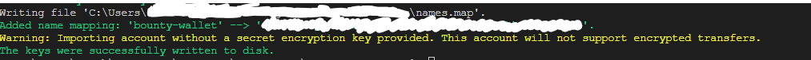


